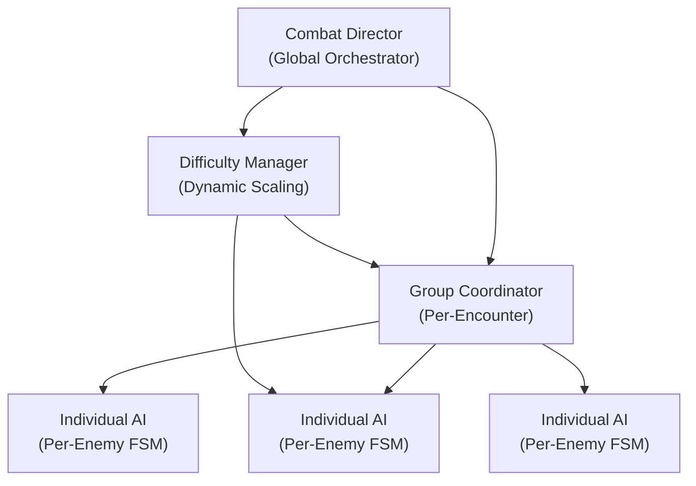
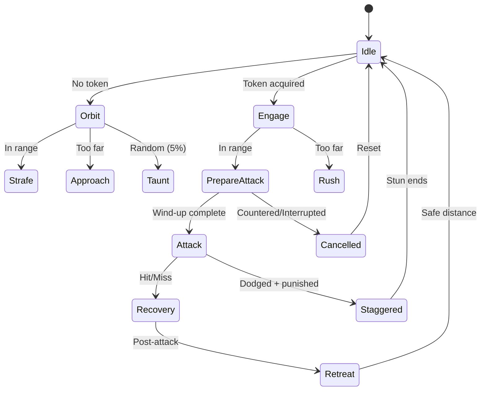

# Análisis Técnico: Enemy AI estilo Marvel's Spider-Man
## Aplicado a Magnet Panic: Scrapstorm

> **Contexto**: Este documento analiza los sistemas de IA enemiga de Marvel's Spider-Man (Insomniac Games, 2018/2023) y propone cómo adaptar sus patrones a tu proyecto, que ya tiene un sólido sistema Arkham-style con `ArkhamEnemy`, `ArkhamEnemyManager` (Attack Director), y `WaveDirector` con actos progresivos.

---

## 1. Arquitectura General de Spider-Man

Spider-Man usa una arquitectura de **3 capas** para sus enemigos:



| Capa | Spider-Man | Tu proyecto actual |
|---|---|---|
| **Director Global** | Combat Director con threat tokens | `ArkhamEnemyManager.AttackDirector()` |
| **Coordinación Grupal** | Group formations, slot system | Parcial: `RandomAvailableEnemy()` con bias por distancia |
| **AI Individual** | Hierarchical FSM por archetype | `ArkhamEnemy` coroutine-based FSM |
| **Dificultad Dinámica** | DDA + encounter presets | `WaveDirectorConfig` con actos + `GetScaledDelay()` |

---

## 2. El Algoritmo Core: Threat Token System

### Cómo funciona en Spider-Man

El sistema más importante es el **Threat Token System** — un recurso limitado que controla cuántos enemigos pueden amenazar al jugador simultáneamente:

```
┌─────────────────────────────────────────────────┐
│                THREAT TOKEN POOL                │
│  Tokens disponibles: N (escala con dificultad)  │
│                                                 │
│  Melee Attack Token:    costo 1                 │
│  Ranged Attack Token:   costo 1                 │
│  Heavy Attack Token:    costo 2                 │
│  Gadget/Special Token:  costo 2                 │
│  Flank Token:           costo 1                 │
└─────────────────────────────────────────────────┘
```

**Reglas fundamentales:**
1. El pool tiene N tokens (3-6 según dificultad)
2. Un enemigo debe **adquirir** un token antes de atacar
3. Al terminar su ataque (hit, miss, countered), **devuelve** el token
4. Si no hay tokens, el enemigo **orbita/strafea** amenazadoramente
5. Enemigos con tokens tienen **prioridad de movimiento** (se acercan)

### Mapeo a tu sistema actual

Tu `ArkhamEnemyManager` ya implementa una versión simplificada:

| Spider-Man | Tu implementación actual | Gap |
|---|---|---|
| Token pool de N tokens | 1 attacker (2 con ≥5 enemies) | Falta granularidad |
| Tokens por tipo (melee/ranged/heavy) | Sin diferenciación | No diferencia costos |
| Token devuelto post-ataque | `WaitUntil(!IsCounterable && !IsAttacking)` | ✅ Similar |
| Enemies sin token strafean | `IdleMovementRoutine()` | ✅ Ya implementado |

> [!IMPORTANT]
> **Recomendación**: Evolucioná tu Attack Director a un Threat Token Pool. No necesitás reescribir — solo agregar un `int availableTokens` y un `Dictionary<ArkhamEnemy, int> heldTokens` al `ArkhamEnemyManager`.

### Implementación sugerida

```csharp
// En ArkhamEnemyManager - evolución del Attack Director
[Header("Threat Token System")]
[SerializeField] int baseTokenPool = 3;
[SerializeField] int tokensPerDifficultyTier = 1;
[SerializeField] int maxTokenPool = 7;

int currentAvailableTokens;
Dictionary<ArkhamEnemy, int> heldTokens = new();

public bool TryAcquireToken(ArkhamEnemy enemy, int cost = 1)
{
    if (currentAvailableTokens >= cost)
    {
        currentAvailableTokens -= cost;
        heldTokens[enemy] = cost;
        return true;
    }
    return false;
}

public void ReleaseToken(ArkhamEnemy enemy)
{
    if (heldTokens.TryGetValue(enemy, out int cost))
    {
        currentAvailableTokens += cost;
        heldTokens.Remove(enemy);
    }
}
```

---

## 3. AI Individual: Hierarchical State Machine

### FSM de Spider-Man por archetype

Spider-Man usa una **Hierarchical FSM** (HFSM) donde cada archetype comparte estados base pero tiene sub-estados únicos:



### Archetypes de Spider-Man mapeados a tus enemigos

| Spider-Man Archetype | Comportamiento | Tu equivalente | Estado |
|---|---|---|---|
| **Thug (melee básico)** | Approach → punch → retreat. Ataca de a uno. | **Scrapling** | ✅ Implementado |
| **Brute** | Super armor, grabs, lanza objetos del entorno. Requiere esquivar, no counter. | **Heavy Bot** | ✅ Parcial (falta grab de objetos ambientales) |
| **Whip/Weapon** | Rango medio, sweep attacks, no counterable directamente. | *No existe aún* | ❌ Post-MVP |
| **Shield** | Bloquea frontalmente, requiere flip-over o air attack. | *No existe aún* | ❌ Post-MVP |
| **Jetpack** | Aéreo, dispara desde arriba, requiere web-pull. | **Spitter Drone** | ✅ Implementado |
| **Rocket Launcher** | Ranged pesado, proyectiles rastreables. | **Spitter Drone variant** | ✅ Parcial |
| **Charger** | Dash lineal con telegraph, evitable. | **Runner Bot** | ✅ Implementado |

---

## 4. Coordinación Grupal: El Slot System

### Cómo Spider-Man coordina grupos

Spider-Man NO deja que los enemigos se muevan libremente alrededor del jugador. Usa un **Slot System circular**:

```
        Slot N (back)
           ○
      ○         ○
  Slot W    ●    Slot E     ● = Player
      ○   PLAYER  ○
           ○
        Slot S (front)
```

**Reglas:**
1. Se generan N slots alrededor del jugador en un **anillo** (radio configurable)
2. Cada enemy **reclama** un slot y se mueve hacia él
3. Los slots rotan lentamente con el jugador
4. Un enemy con Attack Token puede **abandonar su slot** para atacar
5. Al retreating, vuelve a un slot disponible
6. Si el jugador se mueve mucho, los slots se redistribuyen

### Por qué funciona tan bien

Sin Slot System, los enemigos se **clumpean** (se apilan unos sobre otros). Con él:
- El jugador siempre ve enemigos **distribuidos** a su alrededor → legibilidad
- Los enemigos parecen **inteligentes y tácticos** → inmersión
- El director puede elegir enemigos por **posición de slot** (flanking, pincer) → variedad

### Mapeo a tu proyecto

Tu `IdleMovementRoutine()` ya hace strafe izquierda/derecha, pero **sin coordinación entre enemigos**. Dos Scraplings pueden terminar superpuestos en la misma posición.

> [!TIP]
> **Implementación pragmática para Magnet Panic**: No necesitás un slot system full — tu arena es más compacta. Pero sí necesitás **separación forzada entre enemigos idle**. Agregá un vector de repulsión entre enemigos durante strafe:

```csharp
// En ArkhamEnemy.Move() — agregar separación
Vector3 separation = Vector3.zero;
int neighborCount = 0;
float separationRadius = 2.0f;

foreach (var other in manager.Enemies)
{
    if (other == this || other == null || !other.IsAlive) continue;
    Vector3 diff = transform.position - other.transform.position;
    diff.y = 0;
    float dist = diff.magnitude;
    if (dist < separationRadius && dist > 0.01f)
    {
        separation += diff.normalized * (1f - dist / separationRadius);
        neighborCount++;
    }
}

if (neighborCount > 0)
    direction += separation.normalized * 0.4f; // blend suave
```

---

## 5. Dificultad Progresiva en Hordas

### El modelo de Spider-Man: Encounter Presets + DDA

Spider-Man usa **dos sistemas complementarios**:

#### A. Encounter Presets (estático)
Cada encuentro tiene una **receta** predefinida:

```
Encounter "Rooftop_Easy":
  Wave 1: 3x Thug
  Wave 2: 4x Thug + 1x Whip
  Wave 3: 2x Thug + 1x Brute + 1x Shield

Encounter "Rooftop_Hard":  
  Wave 1: 4x Thug + 1x Whip
  Wave 2: 3x Thug + 2x Shield + 1x Rocket
  Wave 3: 1x Brute + 2x Whip + 2x Jetpack
```

#### B. Dynamic Difficulty Adjustment (DDA)
Modifica parámetros en runtime según performance del jugador:

| Métrica monitoreada | Si el jugador va bien | Si el jugador sufre |
|---|---|---|
| HP del player | Más tokens, más agresivos | Menos tokens, más pasivos |
| Kill rate (kills/min) | Spawn más rápido | Spawn más lento |
| Counter rate | Menos telegraphs, más feints | Telegraphs más largos |
| Damage taken rate | Sube dificultad | Baja dificultad |
| Combo length | Introduce counters al combo | Deja fluir combos |

### Tu sistema actual vs. lo que necesitás

**Lo que ya tenés (y está bien):**
- Actos con threat budget escalante → similar a Encounter Presets
- `GetScaledDelay()` que reduce delay del director por tiempo → presión creciente
- `reinforcementThreshold` para evitar downtime
- Puertas con selección ponderada

**Lo que falta para hordas progresivas estilo Spider-Man:**

### 5.1 — Curva de composición de hordas

El truco de Spider-Man es que la dificultad NO sube solo por cantidad, sino por **composición**. Tu `WaveDirectorConfig` ya soporta esto con `enemyPool` por acto, pero necesitás formalizar la curva:

| Oleada | Composición | Presión real | Nuevo mechanic que se introduce |
|---|---|---|---|
| 1-3 | Solo Scraplings | Aprender melee, counter | Counter window |
| 4-6 | Scraplings + Metal Enemy | Aprender magnetismo | Pull/Repel loop |
| 7-9 | + Runner Bot | Dodge lineal | Charge telegraph |
| 10-12 | + Spitter Drone | Gestionar ranged | Projectile intercept |
| 13-15 | + Heavy Bot | Priorización | Grapple escape |
| 16+ | Mezclas complejas | Mastery test | Combos de todo |

> [!IMPORTANT]
> **Regla de oro de Spider-Man**: Nunca introducir más de UN archetype nuevo por "phase". Cada nuevo tipo tiene 2-3 oleadas de gracia donde aparece en baja cantidad para que el jugador aprenda.

### 5.2 — Escalada por dimensiones (no solo cantidad)

Spider-Man escala dificultad en **5 dimensiones independientes**. Tu sistema debería hacer lo mismo:

```
Dimensión 1: CANTIDAD
  Oleada 1: 3 enemigos → Oleada 20: 12-15 enemigos
  (tu maxEnemiesAlive = 18 es el cap correcto)

Dimensión 2: COMPOSICIÓN  
  Oleada 1: 100% Scrapling → Oleada 20: 20% Scrapling, 30% Metal, 
  20% Runner, 15% Spitter, 15% Heavy

Dimensión 3: AGRESIVIDAD (Attack Director)
  Oleada 1: 3 threat tokens, delay 1.5s → Oleada 20: 6 tokens, delay 0.35s

Dimensión 4: VELOCIDAD DE OLEADA
  Oleada 1: rest 2.5s → Oleada 20: rest 0.55s  
  (ya lo tenés con restReductionPerAct)

Dimensión 5: COORDINACIÓN TÁCTICA
  Oleada 1: ataques individuales → Oleada 20: pinzas, flanqueos, 
  combos ranged+melee sincronizados
```

### 5.3 — Difficulty Ramp Config sugerido

```csharp
// Nuevo: agregar a WaveDirectorConfig o como SO separado
[Serializable]
public sealed class DifficultyRampConfig
{
    [Header("Token Scaling")]
    public int baseTokens = 3;
    public int tokensAddedPerAct = 1;
    public int maxTokens = 7;
    
    [Header("Aggression Scaling")]
    [Tooltip("Multiplier to enemy approach speed per act")]
    public float speedMultiplierPerAct = 0.08f;
    public float maxSpeedMultiplier = 1.5f;
    
    [Header("Composition Gates")]
    [Tooltip("Minimum wave before introducing each archetype")]
    public int metalEnemyIntroWave = 4;
    public int runnerBotIntroWave = 7;
    public int spitterDroneIntroWave = 10;
    public int heavyBotIntroWave = 13;
    
    [Header("Coordination Scaling")]
    [Tooltip("Wave at which pincer attacks from opposite doors begin")]
    public int pincerAttackStartWave = 8;
    [Tooltip("Wave at which ranged+melee synchronized attacks begin")]
    public int syncedAttackStartWave = 12;
}
```

---

## 6. Patrones Tácticos de Grupo

### 6.1 — El "Surround & Rotate"

Spider-Man hace que los enemigos **orbiten** alrededor del jugador, creando presión visual constante:

```
Fase 1: Enemigos se distribuyen en arco
    ○   ○   ○
        ●       ← Player
    ○       ○

Fase 2: Orbitan lentamente (cambian slots)
        ○   ○
    ○   ●       
    ○       ○

Fase 3: Uno adquiere token y ataca desde su posición
        ○   ○
    ○   ●   ←── ATACANTE
    ○       
```

**Tu `IdleMovementRoutine()` ya hace esto parcialmente** con strafe left/right. Lo que falta es la **coordinación** para que no todos strafeen en la misma dirección.

### 6.2 — El "Staggered Rush" (clave para hordas)

En hordas grandes, Spider-Man usa **oleadas micro dentro de la macro oleada**:

```
Oleada spawneada: 8 enemigos

  Grupo A (3 scraplings): atacan inmediatamente
  Grupo B (3 scraplings + 1 metal): esperan 1.5s, luego atacan
  Grupo C (1 heavy): espera 3s, entra como amenaza final
```

Esto evita el **wall of enemies** donde 8 cuerpos se apiñan al mismo tiempo.

> [!TIP]
> Tu `spawnInterval` de 0.2-0.45s entre spawns ya hace esto a nivel de aparición. Pero necesitás un **engagement delay** post-spawn: los enemigos recién spawneados deberían tener un `canAttackAfter` timer de 1-2s antes de ser elegibles para el Attack Director.

### 6.3 — El "Pincer Attack" (ataques coordinados)

A partir de dificultad media, Spider-Man envía atacantes desde **direcciones opuestas**:

```
    Atacante A (melee)
         ↓
         ●  ← Player
         ↑
    Atacante B (ranged)
```

El jugador debe elegir: ¿counter al melee o esquivar el proyectil?

**Implementación**: Modificar `RandomAvailableEnemy()` para, en actos avanzados, preferir enemigos en el **hemisferio opuesto** al atacante primario:

```csharp
// En el Attack Director, al elegir segundo atacante:
if (actIndex >= pincerActThreshold && activeAttackers.Count > 0)
{
    Vector3 firstAttackerDir = (activeAttackers[0].transform.position 
                                - player.position).normalized;
    // Preferir enemigos en dirección opuesta
    candidates.Sort((a, b) => {
        float dotA = Vector3.Dot(
            (a.transform.position - player.position).normalized, 
            firstAttackerDir);
        float dotB = Vector3.Dot(
            (b.transform.position - player.position).normalized, 
            firstAttackerDir);
        return dotA.CompareTo(dotB); // menor dot = más opuesto
    });
}
```

---

## 7. Cómo Spider-Man hace que las hordas no se sientan injustas

### 7.1 — "Fairness Rules" (Reglas de justicia)

| Regla | Qué hace | Tu equivalente |
|---|---|---|
| **Max simultaneous attacks** | Nunca más de N ataques a la vez | ✅ `simultaneousAttackThreshold` |
| **Off-screen mercy** | Enemigos fuera de cámara NO atacan | ❌ No implementado |
| **Post-dodge grace** | 0.3s de inmunidad después de esquivar | Depende de tu combat system |
| **Counter telegraph** | Todo ataque tiene visual cue | ✅ `counterIndicator` |
| **New enemy grace** | Enemigos recién spawneados no atacan por 1s | ❌ No implementado |
| **Combo respect** | Si el player está en combo, enemigos esperan 0.5s extra | ❌ No implementado |
| **Health gate** | A bajo HP, enemigos atacan menos frecuentemente | ❌ No implementado |

> [!WARNING]
> Las 3 reglas marcadas como ❌ son **críticas para la experiencia**. Sin "combo respect", el jugador será interrumpido constantemente durante combos y dejará de intentarlos. Sin "new enemy grace", los spawns se sienten injustos.

### 7.2 — Implementación de Fairness

```csharp
// Agregar a ArkhamEnemyManager
bool ShouldDelayAttack()
{
    // Combo respect: si el player está en combo, esperar
    if (playerCombat != null && playerCombat.IsInCombo)
        return true;
    
    // Health gate: a bajo HP, 40% chance de delay extra
    if (playerCombat != null && playerCombat.HealthPercent < 0.25f)
        return Random.value < 0.4f;
    
    return false;
}

// Agregar a ArkhamEnemy.OnSpawn()
float spawnGraceTimer = 1.2f; // no elegible por director por 1.2s

// Modificar CanDirectorSelect:
public bool CanDirectorSelect =>
    IsAlive && !isLockedTarget && !isStunned &&
    !isMagneticallyControlled && !isPreparingAttack &&
    !isAttacking && !isRetreating &&
    Time.time > spawnTime + spawnGraceTimer; // NUEVO
```

---

## 8. Resumen de Implementación para Magnet Panic

### Prioridad Alta (impacto inmediato en game feel)

| Cambio | Archivo | Esfuerzo |
|---|---|---|
| Spawn grace period (1-1.5s) | `ArkhamEnemy.cs` | 🟢 Bajo |
| Separación entre enemigos idle | `ArkhamEnemy.Move()` | 🟢 Bajo |
| Combo respect delay | `ArkhamEnemyManager.cs` | 🟢 Bajo |
| Fairness rules (health gate) | `ArkhamEnemyManager.cs` | 🟢 Bajo |

### Prioridad Media (mejora significativa de profundidad)

| Cambio | Archivo | Esfuerzo |
|---|---|---|
| Threat Token Pool (reemplaza hardcoded 1-2) | `ArkhamEnemyManager.cs` | 🟡 Medio |
| Token scaling por acto en config | `WaveDirectorConfig.cs` | 🟡 Medio |
| Pincer attack selection | `ArkhamEnemyManager.cs` | 🟡 Medio |
| Engagement delay post-spawn | `ArkhamEnemy.cs` | 🟢 Bajo |
| Composición de horda con intro gates | `WaveDirector.cs` | 🟡 Medio |

### Prioridad Baja (polish post-playtest)

| Cambio | Archivo | Esfuerzo |
|---|---|---|
| Full Slot System circular | Nuevo script | 🔴 Alto |
| DDA basado en player performance | Nuevo script | 🔴 Alto |
| Off-screen mercy | `ArkhamEnemyManager.cs` | 🟡 Medio |
| Staggered micro-groups dentro de oleada | `WaveDirector.cs` | 🟡 Medio |

---

## 9. Curva de Dificultad Progresiva Completa

Acá está la curva integrada que recomiendo para tu run:

```
Minuto 0-1:30 (Acto 1 - Tutorial implícito)
├── Tokens: 2
├── Enemies: 3-4 Scraplings por oleada
├── Delay director: 1.5-2.0s
├── Puertas: 1 puerta
├── Objetivo: aprender melee + counter
└── Rest entre oleadas: 2.5s

Minuto 1:30-3:30 (Acto 2 - Introducción magnetismo)
├── Tokens: 3
├── Enemies: 4-6, introduce Metal Enemy (25%)
├── Delay director: 1.2-1.5s  
├── Puertas: 2 puertas (no opuestas)
├── Objetivo: aprender Pull/Repel
└── Rest: 2.0s

Minuto 3:30-6:00 (Acto 3 - Presión lateral)
├── Tokens: 4
├── Enemies: 6-8, introduce Runner Bot (15%)
├── Delay director: 0.9-1.2s
├── Puertas: 2-3, primeros pincer attacks
├── Objetivo: gestionar amenazas direccionales
└── Rest: 1.5s

Minuto 6:00-9:00 (Acto 4 - Caos controlado)
├── Tokens: 5
├── Enemies: 8-12, introduce Heavy Bot (10%) + Spitter (15%)
├── Delay director: 0.6-0.9s
├── Puertas: 3-4, pincer attacks frecuentes
├── Objetivo: priorización + uso completo del toolkit
└── Rest: 1.0s

Minuto 9:00+ (Acto 5 - Endurance)
├── Tokens: 6 (cap)
├── Enemies: 12-18, todas las variantes
├── Delay director: 0.35-0.6s (floor)
├── Puertas: 4, coordinated rushes
├── Objetivo: sobrevivir con mastery
└── Rest: 0.55s (floor)
```

---

> [!NOTE]
> Tu sistema actual ya tiene el **80% de la base correcta**. El `ArkhamEnemy` con coroutines, el Attack Director, el wave system con actos — todo eso es sólido. Los cambios de mayor impacto son los de **fairness** (spawn grace, combo respect) y la evolución a **Threat Tokens** para granularidad. Eso solo ya va a hacer que tus hordas se sientan como Spider-Man.
